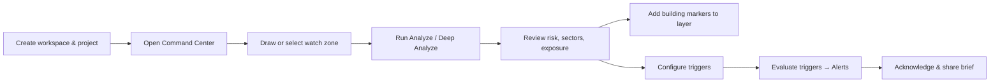

# Sentry — Product Description

**Draw any region. Monitor every disaster signal. Confidence-aware intelligence.**

Sentry is a geospatial operations intelligence platform for disaster coordinators, humanitarian teams, and emergency planners. It combines live hazard feeds, open map data, and AI-assisted analysis into a single command center — so teams can understand risk, exposure, and next steps for any area on Earth in minutes, not hours.

---

## The Problem

When a disaster unfolds or threatens a region, coordinators face the same urgent questions:

- What hazards are active or building in this area?
- What infrastructure and population are exposed?
- Which sub-areas need attention first?
- How do we communicate risk to field teams and leadership?

Today, answering these questions means juggling satellite dashboards, earthquake feeds, weather tools, spreadsheets, and ad-hoc briefs. Data arrives in different formats, at different cadences, with uneven coverage. Sentry unifies that workflow on an interactive map.

---

## Who It's For

| Audience | Use case |
|---|---|
| **Disaster response coordinators** | Assess a drawn or saved region during an active event |
| **Humanitarian / NGO field teams** | Prioritize sectors, track critical facilities, plan verification |
| **Emergency management analysts** | Monitor watch zones and configure automated alert rules |
| **Operations leadership** | Receive structured briefs and severity-ranked alerts |

Sentry is **decision support**, not an official warning system. It helps teams move faster and with more context — field verification is always recommended for emergency decisions.

---

## Core Value Proposition

1. **Region-first analysis** — Draw a polygon anywhere on the map and get a full risk picture for that exact area.
2. **Multi-hazard, one view** — Wildfire, earthquake, flood, drought, cyclone, and more on a single canvas.
3. **Exposure you can act on** — Buildings, roads, schools, hospitals, shelters, and population estimates clipped to your region.
4. **Confidence-aware output** — Every score and brief carries confidence signals and explicit data-gap reporting.
5. **Automated monitoring** — Save watch zones, define triggers in plain language, and fire alerts with optional AI briefs.

---

## Key Features

### Command Center (Map)

The primary workspace. An interactive MapLibre map with:

- **Hazard layers** — Toggle wildfire, earthquake, flood, drought, cyclone, landslide, heat, air quality, and related signals.
- **Infrastructure overlays** — OpenStreetMap buildings, roads, critical facilities, and population context.
- **Draw tools** — Sketch watch-zone polygons and drop observation markers directly on the map.
- **Sector grid** — After analysis, the region is segmented into risk-scored sub-areas for prioritization.
- **Live event timeline** — A rolling feed of detections, trigger fires, analysis runs, and system actions.

### Region Analysis

Select or draw a region, then run **Analyze** or **Deep Analyze**:

| Mode | What you get |
|---|---|
| **Analyze** | Multi-hazard risk scores, sector breakdown, exposed assets, deterministic operational summary |
| **Deep Analyze** | Everything in Analyze, plus an AI-written 11-section operational brief and per-building marker previews |

Risk scoring blends live hazard events, local weather, drought anomalies, wind/downwind exposure, and OSM infrastructure density. Scores are 0–100 with Low / Moderate / High / Severe levels and per-hazard driver explanations.

### Building & Asset Markers

- Manually place markers for field observations.
- **Import from analysis** — Deep Analyze evaluates every OSM building footprint in the region and proposes markers with estimated state (safe, pending, damaged, destroyed, unknown).
- Markers are organized into project **layers** with color coding and category labels (house, school, hospital, shelter, etc.).

### Watch Zones & Triggers

- **Watch zones** — Named, saved polygons tied to a project and hazard watchlist.
- **Trigger rules** — Programmable conditions (e.g., wildfire severity > 70 for 15 minutes) with actions:
  - Dashboard alert
  - Email / SMS / webhook (configured per rule)
  - LLM operational brief
  - Incident task creation
- **Evaluate triggers** — Batch-evaluate all enabled rules against current data and surface fired alerts.

### Alerts & Response Briefs

A dedicated alerts inbox shows severity-ranked notifications from fired triggers. Each alert can include a structured operational brief with suggested SMS-style messages for downstream communication.

### Workspaces, Projects & Layers

Sentry is organized for teams:

```
Workspace  →  Project  →  Layer
   │            │           │
   │            │           └── markers, zones, segments (visibility + color)
   │            └── map viewport, artifacts, analysis snapshots
   └── team boundary, triggers, alerts, members
```

Onboarding walks new users through workspace and first-project creation. Role-based access (admin, analyst, viewer) is supported at the data model level.

---

## Supported Hazards

| Hazard | Primary sources |
|---|---|
| Wildfire | NASA FIRMS |
| Earthquake | USGS |
| Flood, cyclone, drought, volcano, tsunami, severe weather | GDACS |
| Drought (grid cells) | CHIRPS-derived anomaly layer |
| Weather context | Open-Meteo (temperature, humidity, wind, precipitation) |
| Buildings, roads, critical infrastructure | OpenStreetMap via ohsome |

Hazard events refresh on the map (default: every 60 seconds). Source health is surfaced in Settings with states: connected, cached fallback, failed, or needs API key.

---

## Typical Workflow



1. **Set up** — Sign in, create a workspace and project, optionally define map layers.
2. **Define area of interest** — Draw a polygon or load a saved watch zone.
3. **Analyze** — Get risk scores, sector grid, and exposed asset counts.
4. **Go deeper** — Run Deep Analyze for an AI brief and building-level marker proposals.
5. **Monitor** — Save the zone, attach triggers, and evaluate on a schedule or on demand.
6. **Respond** — Review alerts, acknowledge, and export operational briefs.

---

## AI & Briefing

Sentry uses LLMs (OpenAI or OpenRouter) for **Deep Analyze** briefs. The model receives only structured analysis output — risk scores, sectors, exposed assets, active events, configured triggers, and data gaps — and produces:

- An 11-section operational brief (executive summary, risk level, exposed sectors, assets, active events, data gaps, recommended next steps, and more)
- 1–3 suggested alert messages (SMS-length)

Without an API key, **Analyze** still works using a deterministic, rule-based brief derived from the risk engine. Production deployments require a configured LLM key for Deep Analyze.

Building state estimates from analysis are **decision support only** — they are seeded deterministically from hazard exposure and footprint size, not field-verified damage assessments.

---

## Data & Confidence Model

Every analysis returns:

- **Per-hazard risk scores** (0–100) with level, drivers, and evidence
- **Overall risk** and **overall confidence** (0–1)
- **Sector-level breakdown** — sub-grid cells with building counts, road length, and critical asset density
- **Source status** — which feeds contributed and whether data is live or cached
- **Explicit data gaps** — e.g., incomplete OSM coverage, missing weather, cloud-obscured satellite

The platform is transparent about what it knows and what it doesn't. Settings includes a limitations disclosure covering satellite delay, incomplete building data, and the non-predictive nature of earthquake monitoring.

---

## Technical Overview

| Layer | Technology |
|---|---|
| Frontend | Next.js 14, React, MapLibre GL, Tailwind, Zustand |
| Geospatial | Turf.js (buffer, intersect, grid, area) |
| Backend | Next.js API routes |
| Database | PostgreSQL via Prisma |
| Auth | Supabase Auth |
| Cache | Redis (production) |
| LLM | OpenAI / OpenRouter |

The app can run in a **demo mode** with cached hazard snapshots when API keys are absent. Production configuration requires Supabase, Postgres, Redis, and an LLM key.

Optional environment variables:

- `FIRMS_MAP_KEY` — live NASA wildfire detections (cached snapshot used if absent)
- `OPENAI_API_KEY` or `OPENROUTER_API_KEY` — Deep Analyze briefs
- `NEXT_PUBLIC_MAPBOX_TOKEN` — optional basemap token

---

## Pages & Navigation

| Page | Purpose |
|---|---|
| **Command Center** (`/w/:workspace`) | Main map, analysis, inspector panel |
| **Watch Zones & Triggers** (`/zones`) | Manage saved zones and alert rules |
| **Alerts** (`/alerts`) | Trigger-fired notifications and briefs |
| **Projects** (`/projects`) | Project listing and management |
| **Settings** (`/settings`) | Data feed status and limitations |

---

## Positioning Summary

**Sentry is not a replacement for national warning systems or field damage surveys.** It is an operations layer that helps teams:

- Orient quickly on any geography
- Fuse multi-source hazard and exposure data
- Prioritize sectors and assets under uncertainty
- Automate monitoring with configurable triggers
- Produce shareable, structured intelligence products

For teams that need to answer *"What's happening here, what's at risk, and what should we do next?"* — Sentry provides that answer on a map, in minutes.

---

## Brand

The Sentry mark is a heraldic shield with an upward navigation spearhead — protection and directed response. The product tagline:

> **Draw any region. Monitor every disaster signal.**
